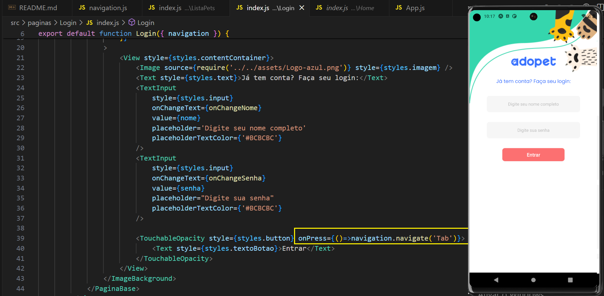

# React : navegação entre telas

Este projeto é fruto do curso de 'React Native: criando menu e navegando entre telas' da plataforma ALURA
 

## Introdução

- O curso trata apenas do desenvolvimento do fluxo da navegação do aplicativo Adopet que se trata Uma rede social para adotantes encontrarem cachorros ou gatos para adoção.

obs: neste curso não foram desenvolvidas qualquer tela da aplicação

## Tecnologias abordadas
 
* React Native
* Expo
* React Navigation

## Link do Figma
Para visualizar o Figma do projeto, clique [aqui](https://www.figma.com/file/47vyLN5bIR6sO3wVX137oK/Adopet-%7C-Rotas-com-React-Native?node-id=518%3A11&mode=dev)

## dependências atuais do projeto

- Dependências:
  - @expo-google-fonts/poppins: Permite a utilização da fonte Poppins do Google Fonts dentro de projetos Expo. Facilita a incorporação de fontes externas.

  - @react-navigation/bottom-tabs: Utilizado para criar uma barra de navegação na parte inferior da tela em aplicativos móveis, permitindo a navegação entre diferentes telas/views.

  - @react-navigation/drawer: Fornece uma gaveta de navegação lateral (drawer) que pode ser aberta para mudar entre diferentes seções do aplicativo.

  - @react-navigation/native: Biblioteca essencial para navegação em aplicativos construídos com React Native, oferecendo uma experiência de navegação consistente entre as plataformas.

  - @react-navigation/native-stack: Oferece uma maneira de usar a navegação em pilha (stack navigation) no React Native, permitindo navegar entre telas com a possibilidade de voltar à tela anterior.

  - expo: Um framework e uma plataforma para aplicações universais React. Facilita o desenvolvimento, a construção, a implantação e a gestão de aplicativos React Native.

  - expo-font: Permite carregar fontes personalizadas no aplicativo, oferecendo mais opções de personalização de texto.

  - expo-status-bar: Proporciona uma maneira simples de configurar a barra de status do dispositivo dentro de aplicativos Expo.

  - react: Uma biblioteca JavaScript para construir interfaces de usuário, sendo o núcleo do desenvolvimento com React Native.

  - react-native: O framework que permite desenvolver aplicativos móveis utilizando JavaScript e React, compilando para código nativo.

  - react-native-gesture-handler: Fornece uma API para gestos e manipulação de toques no React Native, melhorando a experiência de interação do usuário.

  - react-native-linking: Permite interagir com links profundos ou URLs externas, abrindo-os no navegador ou em outras aplicações.

  - react-native-reanimated: Oferece uma API mais poderosa e flexível para animações no React Native, permitindo animações mais complexas e suaves.

  - react-native-safe-area-context: Proporciona acesso às informações de Safe Area do dispositivo, permitindo que o conteúdo seja renderizado dentro das áreas seguras da tela.

  - react-native-screens: Otimiza a navegação entre telas no React Native, utilizando componentes de tela nativos para melhor desempenho.

  - react-native-svg: Permite o uso de SVGs no React Native, facilitando a inclusão de gráficos vetoriais escaláveis.

  - react-native-uuid: Gera identificadores únicos universais (UUIDs) no React Native, útil para identificação única de elementos ou dados.

  - expo-linking: Fornece uma interface para interagir com links profundos e navegação dentro de aplicativos Expo.

- Dependências de Desenvolvimento :

  - @babel/core: O compilador JavaScript Babel é utilizado para transformar o código JSX/ES6 em um formato compatível com versões anteriores de JavaScript, garantindo a compatibilidade entre diferentes ambientes de execução.

 ## Instalação do react navigation

  - https://reactnative.dev/docs/navigation#react-navigation 

  - @react-navigation/native: Este é o pacote principal do React Navigation, que fornece a funcionalidade de navegação entre diferentes telas e componentes em aplicativos React Native. Ele oferece uma maneira de configurar e trabalhar com a navegação de forma eficiente, utilizando uma abordagem baseada em componentes JavaScript.

  - @react-navigation/native-stack: Este pacote fornece um componente de pilha de navegação específico, createNativeStackNavigator, que utiliza as APIs nativas de navegação para uma transição de telas mais eficiente e com melhor desempenho. Ele é uma alternativa ao createStackNavigator tradicional, oferecendo animações e gestos que são mais consistentes com as expectativas dos usuários em plataformas iOS e Android.

  - react-native-screens: Este pacote otimiza a memória e o desempenho do aplicativo ao utilizar componentes de tela nativos, em vez de simular a navegação apenas com componentes JavaScript. Ele permite que as telas sejam tratadas de maneira mais eficiente pelo sistema operacional, melhorando a resposta do aplicativo e reduzindo o consumo de recursos.

  - react-native-safe-area-context: Este pacote fornece uma API para acessar as informações da área segura do dispositivo, que é a área da tela não obstruída por entalhes, bordas arredondadas, barras de navegação e outros elementos intrusivos. Ele é essencial para garantir que os elementos da interface do usuário sejam visíveis e acessíveis, independentemente das características específicas do hardware do dispositivo.

## Implementando a navegação

  - Verificando o projeto obsevemos que temos a pasta "src" e dentro dela temos a pasta "paginas", que contém :

    - Cadastro
    - Home
    - Inbox
    - ListaPets ... Entre outras

Nesse projeto, será utilizada a biblioteca React Navigation

> npm install @react-navigation/native

obs : a navegação será do tipo stack que fara uma transição entre telas, onde cada nova tela é colocada no topo de outra tela, formando uma pilha.

> npm install @react-navigation/stack

obs :a biblioteca react-navigation/native, serve apenas como a estrutura base para as rotas. 

Com isso é criada a classe Navigation onde serão definidas as rotas e alterada a para navigation em App.js

  - classe Navigation

 - classe App

  

alinhando o layout com o figma removendo o titulo

 

##  Configurando o fluxo de navegação para torna-se funcional

 - Configurando a navegação na tela Home

  

 - Ajuste de navogation para tela cadastro

   

## Navegação via Botton Tabs Navigator

   Observando o figma, mais especificamente a tela 'ListaPets' os botões na base da tela onde concluimos a necessidade de usar outro tipo de navegação que desta vez será 'Botton Tabs Navigator'

  Sendo assim, é necessário instalar a dependência para 'bottom-tab-navigator'

https://reactnavigation.org/docs/bottom-tab-navigator

  - npm install @react-navigation/bottom-tabs

Continuando a adaptação, será necessáro criar as rotas em Navigation fazendo um alinhamento de rota ou seja dentro do 'stack' sera feita a porta de entrada para o tab navigator  

 

Agora é preciso ajustar o Login para que faça a navegação para 'ListaPets'

